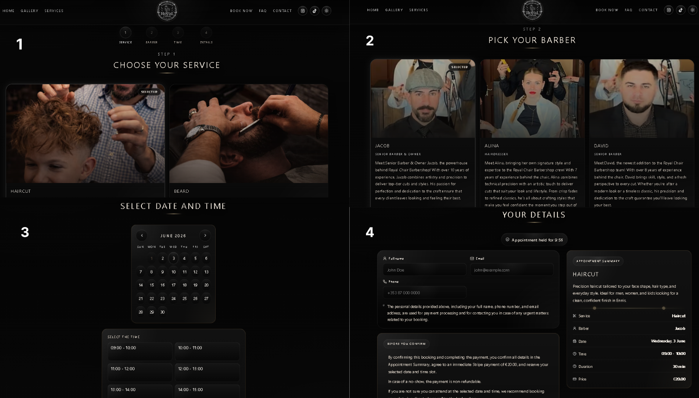
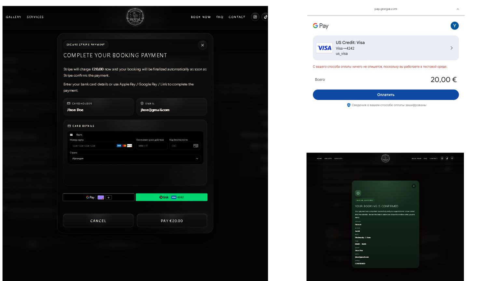
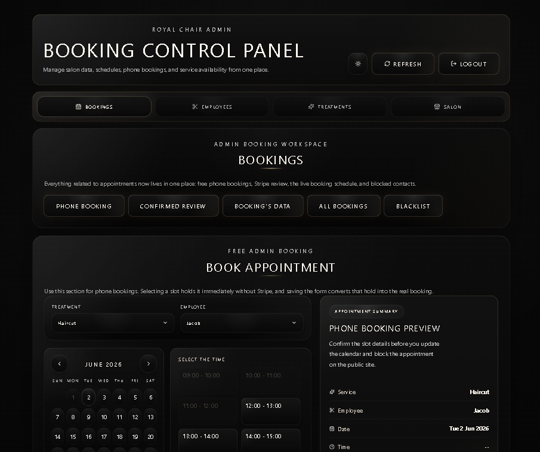
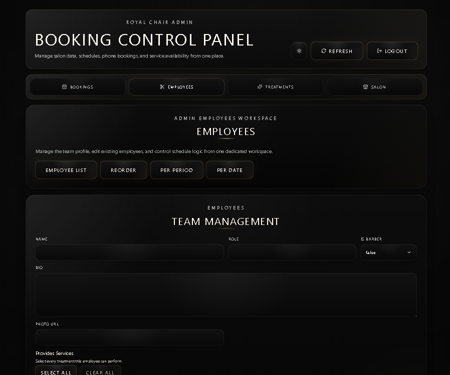

# Salon Booking Platform

A full-stack appointment booking platform for a salon/barbershop business, built with Spring Boot and React.

The project demonstrates a realistic booking workflow rather than a simple CRUD demo: customers browse salon data, reserve a time slot, complete a Stripe-backed payment flow, and admins manage bookings, employees, treatments, salon hours, schedules, and booking safety controls.

## Live Demo

- Public site: `https://booking-engine-frontend.onrender.com/`
- Admin app: `https://booking-engine-frontend.onrender.com/admin.html`

Admin demo access is available on request for portfolio review purposes.

## Screenshots

### Public Home Page


### Services Catalog


### Booking Flow



### Stripe Payment Step



### Admin Bookings Dashboard



### Admin Management



## Demo Walkthrough

The screenshots above show the main public and admin flows. Reviewers can also validate the app manually through this flow:

1. Open the public site and review the home, services, FAQ, gallery/team, and responsive navigation views.
2. Start a booking from `/booking`: choose treatment, employee, date/time, and customer details.
3. Confirm that public slot holds are created before checkout and that unavailable slots are protected from duplicate selection.
4. Use Stripe test mode to validate the payment setup and confirmation path.
5. Open the admin app at `/admin.html`, log in, and review the bookings dashboard.
6. Review admin management flows for employees, treatments, salon profile/hours, schedules, booking holds, cancellations, and blacklist entries.

## Highlights

- Stripe-backed booking flow with slot holds, checkout preparation, and payment confirmation.
- Admin dashboard for bookings, employees, treatments, salon profile, hours, schedules, and blacklist entries.
- JWT-backed `HttpOnly` admin cookies with CSRF protection for unsafe admin requests.
- Flyway-managed PostgreSQL schema with Docker and Render deployment support.
- GitHub Actions CI for backend tests, dependency scanning, and frontend lint/test/build.

## Tech Stack

**Frontend:** React 18, Vite, React Router, Tailwind CSS, custom CSS, Framer Motion, Stripe React SDK, React Helmet Async, Vitest, Testing Library, ESLint, Prettier.

**Backend:** Java 21, Spring Boot 4, Spring Web MVC, Spring Security, Spring Data JPA/Hibernate, PostgreSQL, Flyway, MapStruct, Stripe Java SDK, JJWT, JUnit, Mockito, MockMvc, JaCoCo, SpotBugs, OWASP Dependency Check.

**Infrastructure:** Docker Compose for local PostgreSQL, backend Dockerfile for container deployment, Render Blueprint, GitHub Actions, PostgreSQL JDBC configuration compatible with Neon-style hosted databases.

## Key Engineering Challenges

- Preventing double-booking with slot holds.
- Synchronizing Stripe PaymentIntent and webhook state.
- Protecting admin sessions with `HttpOnly` cookies and CSRF checks.
- Failing fast on unsafe production configuration.
- Sanitizing sensitive operational logs.
- Documenting single-instance rate limiting tradeoffs.

## Architecture

The repository has a Spring Boot backend, a React/Vite public frontend, a separate React admin entry point, PostgreSQL persistence, Flyway migrations, and Stripe PaymentIntent/webhook integration.

```text
Browser -> React public/admin apps -> Spring Boot API -> PostgreSQL
                                      Spring Boot API <-> Stripe API/webhooks
```

See [Architecture](docs/architecture.md) for the Mermaid diagram, package layout, and frontend routing details.

## Local Setup

Prerequisites:

- Java 21
- Node.js 20+ and npm
- Docker Desktop, or another PostgreSQL 16-compatible database
- Stripe test keys for full payment testing

Local run:

The application does not seed an admin user automatically.
For first-time local admin access, see the Admin Bootstrap section in the [Deployment Guide](docs/deployment.md).

Initial setup (run once from the repository root):

```bash
cp .env.example .env
cp backend/.env.local.example backend/.env.local
cp frontend/.env.development.example frontend/.env.development
docker compose up -d postgres
```

Before starting the backend, edit the copied env files. At minimum, align the local PostgreSQL password and replace `APP_JWT_SECRET` with a strong non-placeholder value. Add valid Stripe test values if you want to test payments.

Backend (Terminal 1):

```bash
cd backend
mvn spring-boot:run
```

Frontend (Terminal 2):

```bash
cd frontend
npm ci
npm run dev
```

A fresh local database contains only the base salon configuration. Treatments, employees, and schedules must be created through the admin interface before the full booking flow is available.

Local URLs:

- Public frontend: `http://localhost:5173`
- Admin entry: `http://localhost:5173/admin.html`
- Backend API: `http://localhost:8080`
- Backend health: `http://localhost:8080/actuator/health`

Real Stripe payment and wallet-style testing requires valid Stripe test keys, webhook forwarding to the local backend, and usually an HTTPS tunnel such as ngrok.
See [Deployment Guide](docs/deployment.md) for complete environment variable, Stripe local testing, ngrok, and Render deployment configuration.

## Additional Documentation

- [Architecture](docs/architecture.md)
- [API Reference](docs/api.md)
- [Security Notes](docs/security.md)
- [Testing & CI](docs/testing.md)
- [Deployment Guide](docs/deployment.md)
