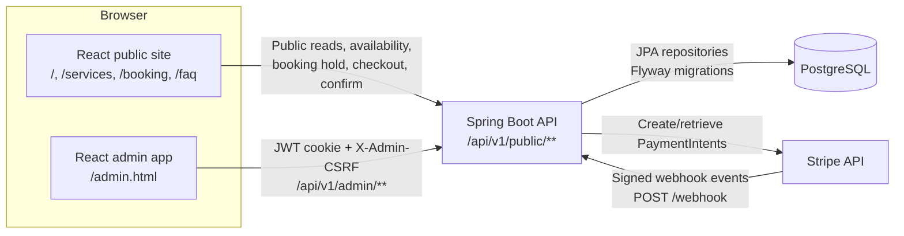

# Architecture

This project is split into a Spring Boot backend, a React/Vite public site, a React admin entry point, PostgreSQL persistence, Flyway migrations, and Stripe PaymentIntent/webhook integration.

## Runtime Diagram



## Repository Layout

```text
booking-engine/
  backend/       Spring Boot API, persistence, security, Stripe integration, tests
  frontend/      React public site and admin app
  docs/          Architecture, API, security, testing, and deployment notes
  render.yaml    Render deployment blueprint
```

## Backend Package Highlights

- `controller` exposes public, admin, auth, availability, and Stripe webhook endpoints.
- `service` and `service.impl` hold booking, scheduling, payment, admin, validation, and lifecycle logic.
- `repository` contains Spring Data JPA repositories.
- `entity` contains database entities and enums.
- `dto` contains request/response contracts used at the API boundary.
- `mapper` contains MapStruct mappers between entities and DTOs.
- `security` contains JWT, admin cookie auth, CSRF header enforcement, rate limiting, proxy/IP handling, and audit helpers.
- `exception` contains centralized API error handling.
- `scheduler` contains background maintenance jobs for booking expiration and schedule autofill.
- `properties` and `config` contain typed configuration and Spring setup.

## Frontend Layout

- Public entry: `frontend/src/main.jsx`
- Admin entry: `frontend/src/admin/main.jsx`
- Public routes: `/`, `/services`, `/booking`, `/faq`
- Admin entry URL: `/admin.html`
- Admin internal routes use hash routing, for example `/admin.html#/bookings`, `/admin.html#/employees`, `/admin.html#/treatments`, and `/admin.html#/salon`
- API wrappers: `frontend/src/api/publicApi.js` and `frontend/src/admin/api.js`

The public app also redirects `/admin` style paths to the admin entry point.

## Persistence and Bootstrap

Flyway migration `backend/src/main/resources/db/migration/V1__init_schema.sql` creates the schema and seeds the singleton salon record:

```text
550e8400-e29b-41d4-a716-446655440000
```

`APP_HAIR_SALON_ID` defaults to that seeded salon ID. If a custom salon ID is configured, a matching `hair_salon` row must already exist or startup fails through `HairSalonConfigurationValidator`.

Admin users are not seeded by Flyway. They are created through the controlled admin bootstrap flow described in [Deployment Guide](deployment.md) and [Security Secret Rotation](security-secret-rotation.md).

## Single-Instance Assumptions

The current rate limiting and scheduler behavior are designed for a single VPS or single Render backend instance. In-memory limiter state is process-local. Horizontal scaling would require shared rate limiting, external scheduler locking, or equivalent enforcement at the edge/load balancer.
